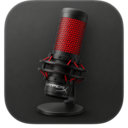
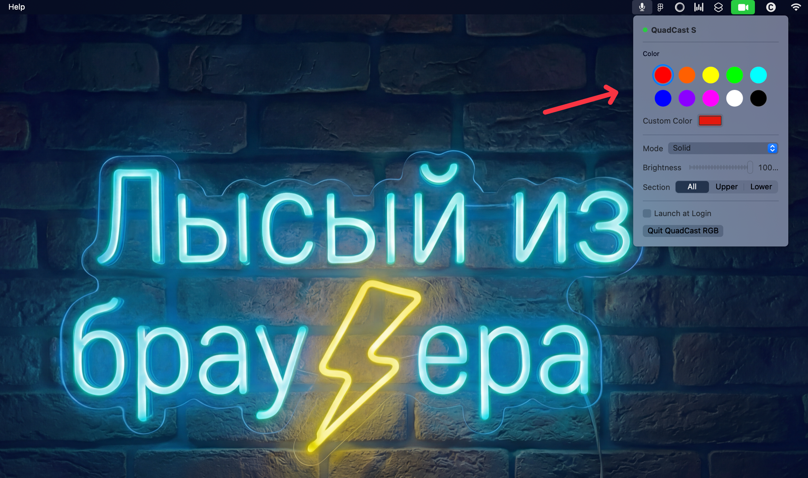

English | [Русский](README.ru.md)

# QuadCast RGB



Control your HyperX QuadCast S RGB lighting directly from the macOS menu bar — no extra apps, no HyperX NGENUITY required.

> Requires macOS 14 Sonoma or later.

---

## Features

- **10 color presets** — red, orange, yellow, green, cyan, blue, purple, pink, white, off
- **Custom color** via the native macOS color picker
- **5 lighting modes** — Solid, Blink, Cycle, Wave, Lightning
- **Brightness control** — 0 to 100%
- **Section control** — target the upper, lower, or full ring independently
- **Auto-apply** — settings are re-applied when the mic is plugged in or the Mac wakes from sleep
- **Launch at Login** — optional autostart with macOS
- **Persistent settings** — remembers your last configuration across restarts



---

## Installation

### Homebrew (recommended)

```bash
brew tap aislam23/tap
brew install --cask quadcast-menubar
```

To update:

```bash
brew update && brew upgrade --cask quadcast-menubar
```

### Manual

Download the latest `.zip` from the [releases page](https://github.com/aislam23/QuadCastMenuBar/releases), unzip it, and move `QuadCastMenuBar.app` to `/Applications`.

---

## Usage

After launching, a microphone icon appears in the menu bar:

- **`mic.fill`** — microphone connected
- **`mic.slash`** — microphone not found

Click the icon to open the control panel. Changes are applied instantly.

---

## Building from Source

**Requirements:** macOS 14+, Xcode Command Line Tools

```bash
xcode-select --install   # if not already installed
```

```bash
git clone https://github.com/aislam23/QuadCastMenuBar.git
cd QuadCastMenuBar
./build.sh
```

The app bundle will be placed in `build/QuadCastMenuBar.app`.

**Build with Developer ID signing:**

```bash
SIGN_IDENTITY="Developer ID Application: Your Name (TEAMID)" ./build.sh
```

---

## Project Structure

| File | Purpose |
|------|---------|
| `Sources/QuadCastMenuBarApp.swift` | App entry point, `MenuBarExtra` |
| `Sources/ContentView.swift` | Control panel UI |
| `Sources/AppState.swift` | App state, color presets |
| `Sources/QuadCastService.swift` | Launches `quadcastrgb`, manages the process |
| `Sources/USBDeviceMonitor.swift` | Tracks USB connect/disconnect events |
| `Sources/SystemEventMonitor.swift` | Reacts to system wake |
| `Resources/Info.plist` | Bundle metadata |
| `Resources/entitlements.plist` | Entitlements for hardened runtime |
| `build.sh` | Build script |

---

## License

MIT © [Artem Islamov](https://github.com/aislam23)

This app bundles [`quadcastrgb`](https://github.com/Ors1mer/QuadcastRGB) © Ors1mer, distributed under the [GNU GPL v2.0](https://www.gnu.org/licenses/old-licenses/gpl-2.0.html). See [NOTICES](NOTICES) for details.
